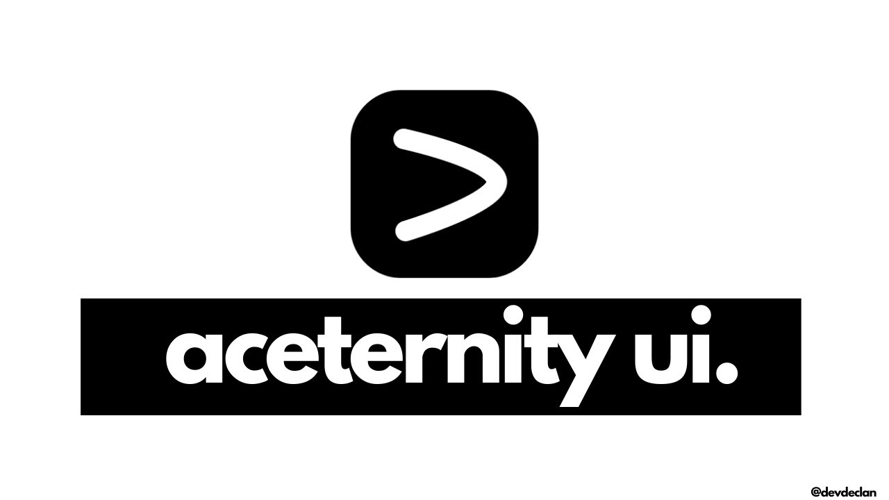
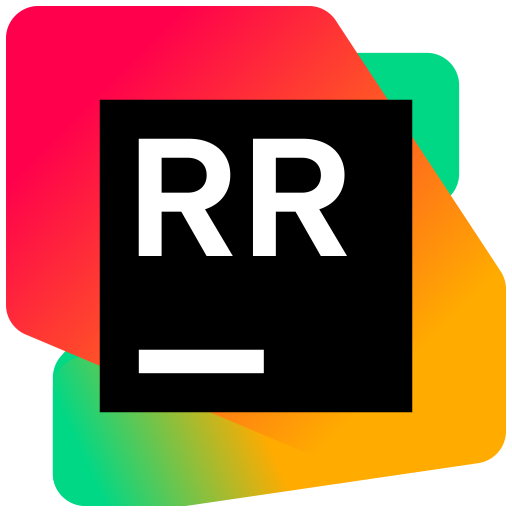

## Hey 👋 What's up?

<h2 align="left">About me</h2>

My name is Mahmoud Majed and I'm a Creative Person, from Egypt

✨ Think outside the box Solution  📚 I'm currently learning fullstack & Software  🎯 Goals: Big Dreams 🎲 Fun fact: I don't know impossible

## Contact

  <a href="" target="_blank" style="text-decoration: none;">
    

      <svg style="width: 20px; height: 20px; fill: white;" viewBox="0 0 24 24"><path d="M23.498 6.186a3.016 3.016 0 0 0-2.122-2.136C19.505 3.545 12 3.545 12 3.545s-7.505 0-9.377.505A3.017 3.017 0 0 0 .502 6.186C0 8.07 0 12 0 12s0 3.93.502 5.814a3.016 3.016 0 0 0 2.122 2.136c1.871.505 9.376.505 9.376.505s7.505 0 9.377-.505a3.015 3.015 0 0 0 2.122-2.136C24 15.93 24 12 24 12s0-3.93-.502-5.814zM9.545 15.568V8.432L15.818 12l-6.273 3.568z"/></svg>
      YOUTUBE
    

  </a>

  <a href="" target="_blank" style="text-decoration: none;">
    

      <svg style="width: 20px; height: 20px; fill: white;" viewBox="0 0 24 24"><path d="M12 2.163c3.204 0 3.584.012 4.85.07 3.252.148 4.771 1.691 4.919 4.919.058 1.265.069 1.645.069 4.849 0 3.205-.012 3.584-.069 4.849-.149 3.225-1.664 4.771-4.919 4.919-1.266.058-1.644.07-4.85.07-3.204 0-3.584-.012-4.849-.07-3.26-.149-4.771-1.699-4.919-4.92-.058-1.265-.07-1.644-.07-4.849 0-3.204.013-3.583.07-4.849.149-3.227 1.664-4.771 4.919-4.919 1.266-.057 1.645-.069 4.849-.069zm0-2.163c-3.259 0-3.667.014-4.947.072-4.358.2-6.78 2.618-6.98 6.98-.059 1.281-.073 1.689-.073 4.948 0 3.259.014 3.668.072 4.948.2 4.358 2.618 6.78 6.98 6.98 1.281.058 1.689.072 4.948.072 3.259 0 3.668-.014 4.948-.072 4.354-.2 6.782-2.618 6.979-6.98.059-1.28.073-1.689.073-4.948 0-3.259-.014-3.667-.072-4.947-.196-4.354-2.617-6.78-6.979-6.98-1.281-.059-1.69-.073-4.949-.073zm0 5.838c-3.403 0-6.162 2.759-6.162 6.162s2.759 6.163 6.162 6.163 6.162-2.759 6.162-6.163c0-3.403-2.759-6.162-6.162-6.162zm0 10.162c-2.209 0-4-1.79-4-4 0-2.209 1.791-4 4-4s4 1.791 4 4c0 2.21-1.791 4-4 4zm6.406-11.845c-.796 0-1.441.645-1.441 1.44s.645 1.44 1.441 1.44c.795 0 1.439-.645 1.439-1.44s-.644-1.44-1.439-1.44z"/></svg>
      INSTAGRAM
    

  </a>

  <a href="mailto:" style="text-decoration: none;">
    

      <svg style="width: 20px; height: 20px; fill: white;" viewBox="0 0 24 24"><path d="M24 5.457v13.909c0 .904-.732 1.636-1.636 1.636h-3.819V11.73L12 16.64l-6.545-4.91v9.273H1.636A1.636 1.636 0 0 1 0 19.366V5.457c0-2.023 2.309-3.178 3.927-1.964L5.455 4.64 12 9.548l6.545-4.91 1.528-1.145C21.69 2.28 24 3.434 24 5.457z"/></svg>
      GMAIL
    

  </a>

  <a href="" target="_blank" style="text-decoration: none;">
    

      <svg style="width: 20px; height: 20px; fill: white;" viewBox="0 0 24 24"><path d="M20.447 20.452h-3.554v-5.569c0-1.328-.027-3.037-1.852-3.037-1.853 0-2.136 1.445-2.136 2.939v5.667H9.351V9h3.414v1.561h.046c.477-.9 1.637-1.85 3.37-1.85 3.601 0 4.267 2.37 4.267 5.455v6.286zM5.337 7.433c-1.144 0-2.063-.926-2.063-2.065 0-1.138.92-2.063 2.063-2.063 1.14 0 2.064.925 2.064 2.063 0 1.139-.925 2.065-2.064 2.065zm1.782 13.019H3.555V9h3.564v11.452zM22.225 0H1.771C.792 0 0 .774 0 1.729v20.542C0 23.227.792 24 1.771 24h20.451C23.2 24 24 23.227 24 22.271V1.729C24 .774 23.2 0 22.222 0h.003z"/></svg>
      LINKEDIN
    

  </a>

  <a href="https://www.coursera.org/user/yourprofile" target="_blank" style="text-decoration: none;">
    

      <svg style="width: 20px; height: 20px; fill: white;" viewBox="0 0 24 24"><path d="M12 3L1 9l11 6 9-4.91V17h2V9M5 13.18v4L12 21l7-3.82v-4L12 17l-7-3.82z"/></svg>
      COURSERA
    

  </a>

## Core Skills

  
  
  
  
  
  
  

## Front-end

  
  
  
  
  
  
  
  
  
  
  
  

## Backend

  
  
  
  
  
  
  

## Tools

  
  
  
  

## Testing

  
  

## Manage and Control

  
  
  
  

## Certificates we proud

  

